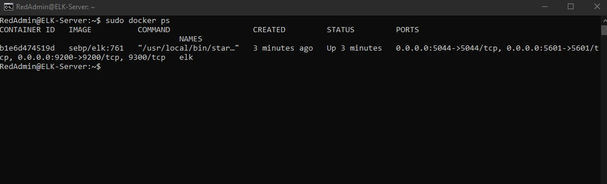

## Automated ELK Stack Deployment 

The files in this repository were used to configure the network depicted below. 

These files have been tested and used to generate a live ELK deployment on Azure. They can be used to either recreate the entire deployment pictured above. Alternatively, select portions of the _____ file may be used to install only certain pieces of it, such as Filebeat.

  - _TODO: Enter the playbook file._

    [filebeat-playbook](https://github.com/aidenk1m/scripts/blob/main/ansible/Filebeat/filebeat-playbook-yml_script)

This document contains the following details:
- Description of the Topology
- Access Policies
- ELK Configuration
  - Beats in Use
  - Machines Being Monitored
- How to Use the Ansible Build

### Description of the Topology

The main purpose of this network is to expose a load-balanced and monitored instance of DVWA, the D*mn Vulnerable Web Application.

Load balancing ensures that the application will be highly _____, in addition to restricting _____ to the network.
- _TODO: What aspect of security do load balancers protect?  Protects against distributed denial-of-service (DDoS) attacks.
- _What is the advantage of a jump box?_ We can setup all machines through jump box.

Integrating an ELK server allows users to easily monitor the vulnerable VMs for changes to the _____ and system _____.
- What does Filebeat watch for?_  Monitors log data and files.
- What does Metricbeat record? Metrics from the operating system and from services running on the server.
- _The configuration details of each machine may be found below.
  _Note: Use the [Markdown Table Generator](http://www.tablesgenerator.com/markdown_tables) to add/remove values from the table_.

| Name     | Function            | IP Address | Operating System |
| -------- | ------------------- | ---------- | ---------------- |
| Jump Box | Gateway             | 10.0.0.4   | Ubuntu 18.04     |
| Web 1    | Web Application     | 10.0.0.5   | Ubuntu 18.04     |
| Web 2    | Web Application     | 10.0.0.6   | Ubuntu 18.04     |
| ELK      | Security Monitoring | 10.1.0.4   | Ubuntu 18.04     |

### Access Policies

The machines on the internal network are not exposed to the public Internet. 

Only the ELK machine can accept connections from the Internet. Access to this machine is only allowed from the following IP addresses:

- 10.0.0.4 (jump-box)

Machines within the network can only be accessed by _____.
- 10.0.0.4 (jump-box)

A summary of the access policies in place can be found in the table below.

| Name          | Publicly Accessible | Allowed IP Addresses |
| ------------- | ------------------- | -------------------- |
| Jump Box      | No                  | Home IP              |
| Web 1         | No                  | 10.0.0.4             |
| Web 2         | No                  | 10.0.0.4             |
| ELK           | No                  | 10.0.0.4             |
| Load Balancer | Yes                 | All                  |

### Elk Configuration

Ansible was used to automate configuration of the ELK machine. No configuration was performed manually, which is advantageous because...
-  What is the main advantage of automating configuration with Ansible? We can configure multiple machines using the same ansible playbook.

The playbook implements the following tasks:

- Installs Docker
- Installs pip3 (python 3 package manager)
- Installs docker python module
- Increases virtual memory
- Downloads and launches a docker elk container
- Binds host ports to container ports
- Enables docker service on boot 

- The following screenshot displays the result of running `docker ps` after successfully configuring the ELK instance.

### Target Machines & Beats
This ELK server is configured to monitor the following machines:
- Web 1 (10.0.0.5) and Web 2 (10.0.0.6)

We have installed the following Beats on these machines:
- File beat and Metric beat

These Beats allow us to collect the following information from each machine:
- File beat monitors files and logs while sending that data to Elasticsearch. Metric beat monitors the operating system and services running on the operating system and sends that data to Elasticsearch as well. 

### Using the Playbook
In order to use the playbook, you will need to have an Ansible control node already configured. Assuming you have such a control node provisioned: 

SSH into the control node and follow the steps below:
- Copy the ansible the [playbook](https://github.com/aidenk1m/scripts/blob/main/ansible/Filebeat/filebeat-playbook-yml_script) file to `/etc/ansible/filebeat-config.yml`
- Update the hosts file to include the ip addresses of web 1 and web 2 
- Run the playbook, and navigate to the Kibana IP to check that the installation worked as expected.
